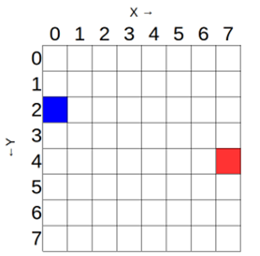
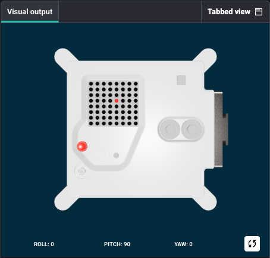

<h2 class="c-project-heading--task">Light a pixel</h2>

The Sense HAT’s LED matrix uses a coordinate system with an x- and a y-axis. The numbering of both axes begins at `0` (not 1) in the top left-hand corner. Each LED can be used as one pixel of an image, and it can be addressed using an `x, y` notation.

In this image, the blue pixel is at coordinates `0, 2`.
The red pixel is at coordinates `7, 4`.

--- task ---

Set the pixel at position 3,3 to red.

Setting **r** to `255`, with **g** and **b** set to `0` means that the pixel will display full red.

--- /task ---

--- code ---
---
language: python
filename: main.py
line_numbers: true
line_number_start: 1
line_highlights: 5-9
---
from sense_hat import SenseHat

sense = SenseHat()

x = 3
y = 3
r = 255
g = 0
b = 0

sense.set_pixel(x, y, r, g, b)

--- /code ---

**Run** your code to see the result.

### Tip

- x is the horizontal axis, and can have a value between 0 (on the left) and 7 (on the right).
- y is the vertical axis, and can have a value between 0 (at the top) and 7 (at the bottom).
- Therefore, the x, y coordinates 0, 0 address the top left-hand LED, and the x, y coordinates 7, 7 address the bottom right-hand LED.

- Each pixel can be given value for r, g and b between 0 (fully off) and 255 (fully on).
- r = Red
- g = Green
- b = Blue

