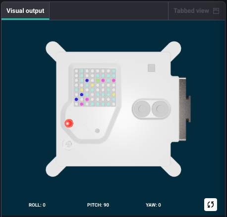

<h2 class="c-project-heading--task">Add a loop</h2>

Rather than repeatedly running your program by pressing **Run**, you can add a loop to keep it running by itself.

<h2 class="c-project-heading--explainer">Follow these instructions</h2>

Import the sleep module, then add an infinite loop and indent all of the lines of code containing your variables and `set_pixel` so that they are within the loop.

--- code ---
---
language: python
filename: main.py
line_numbers: true
line_number_start: 1
line_highlights: 3, 7-14
---
from sense_hat import SenseHat
from random import randint
from time import sleep

sense = SenseHat()

while True:
    x = randint(0, 7)
    y = randint(0, 7)
    r = randint(0, 25)
    g = randint(0, 55)
    b = randint(0, 85)
    sense.set_pixel(x, y, r, g, b)
    sleep(0.1)
--- /code ---

## Now run your code

Run your code and check that random coloured pixels keep sparkling on the Sense HAT.
